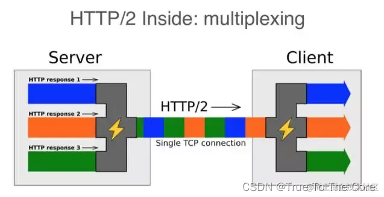

## 一、HTTP/HTTPS 简介

`HTTP` 协议是 `Hyper Text Transfer Protocol`（超文本传输协议）的缩写，是用于从万维网（ `WWW:World Wide Web` ）服务器传输超文本到本地浏览器的传送协议。

`HTTP` 是一个基于 `TCP/IP` 通信协议来传递数据（`HTML` 文件、图片文件、查询结果等）。

`HTTPS` 协议是 `Hyper Text Transfer Protocol Secure`（超文本传输安全协议）的缩写，是一种通过计算机网络进行安全通信的传输协议。

`HTTPS` 经由 `HTTP` 进行通信，但利用 `SSL/TLS` 来加密数据包，`HTTPS` 开发的主要目的，是提供对网站服务器的身份认证，保护交换资料的隐私与完整性。

`HTTP` 的 `URL` 是由 `http://` 起始与默认使用端口 `80`，而 `HTTPS` 的 `URL` 则是由 `https://` 起始与默认使用端口 `443`。

## 二、http 历史

### HTTP/0.9

`HTTP` 是基于 `TCP/IP` 协议的应用层协议。它不涉及数据包（packet）传输，主要规定了客户端和服务器之间的通信格式，默认使用 80 端口。 最早版本是 1991 年发布的 0.9 版。该版本极其简单，只有一个命令 `GET`。

### HTTP/1.0

随着互联网的发展以及浏览器的出现，单纯的文本内容已经无法满足用户需求了，浏览器希望通过 `HTTP` 来传输脚本、样式、图片、音频和视频等不同类型的文件，所以在 1996 年 `HTTP` 更新的 1.0 版本中引入了如下特性：

增加了 `HEAD`、`POST` 等新方法

增加了响应状态码，如果处理失败，则可以用它了解发生了哪种错误；

引入了协议版本号概念

引入了 `HTTP Header`（头部）的概念，让 `HTTP` 处理请求和响应更加灵活

传输的数据不再局限于文本

相对于 HTTP/0.9 大致增加了如下几点：

- 首先，任何格式的内容都可以发送。这使得互联网不仅可以传输文字，还能传输图像、视频、二进制文件。这为互联网的大发展奠定了基础。

- 其次，除了 `GET` 命令，还引入了 `POST` 命令和 `HEAD` 命令，丰富了浏览器与服务器的互动手段。

- 再次，`HTTP` 请求和回应的格式也变了。除了数据部分，每次通信都必须包括头信息（`HTTP header`），用来描述一些元数据。

- 其他的新增功能还包括状态码（`status code`）、多字符集支持、多部分发送（`multi-part type`）、权限（`authorization`）、缓存（`cache`）、内容编码（`content encoding`）等。

- 其中最核心的改变是增加了头部设定，头部内容以键值对的形式设置。请求头部通过 Accept 字段来告诉服务端可以接收的文件类型，响应头部再通过 `Content-Type` 字段来告诉浏览器返回文件的类型。

- 头部字段不仅用于解决不同类型文件传输的问题，也可以实现其他很多功能如缓存、认证信息等，这些更新内使得它逐渐发展成一种可扩展且灵活的通用协议

### HTTP/1.1

随着互联网的迅速发展，`HTTP/1.0` 也已经无法满足需求，最核心的就是连接问题。

具体来说就是 `HTTP/1.0` 每进行一次通信，都需要经历建立连接、传输数据和断开连接三个阶段。当一个页面引用了较多的外部文件时，这个建立连接和断开连接的过程就会增加大量网络开销。

1997 年 1 月，`HTTP/1.1` 版本发布，只比 1.0 版本晚了半年。它进一步完善了 `HTTP` 协议，一直用到了 20 年后的今天，直到现在还是最流行的版本。

为了解决 `HTTP/1.0` 的问题，1999 年推出的 `HTTP/1.1` 有以下特点：

#### HTTP/1.1 的新特性

- 支持长连接（`Connection：keep-alive`）：引入了 `TCP` 连接复用，即一个 `TCP` 默认不关闭，可以被多个请求复用

- 并发连接：对一个域名的请求允许分配多个长连接（缓解了长连接中的「队头阻塞」问题）
  引入管道机制，一个 `TCP` 连接，可以同时发送多个请求。（响应的顺序必须和请求的顺序一致，因此不常用）

- 增加了 `PUT、DELETE、OPTIONS、PATCH` 等新的方法

- 新增缓存字段（`cache-control E-tag`），用于缓存管理和控制

- 请求头中引入了 `range` 字段，支持断点续传

- 允许响应数据分块（`chunked`），利于传输大文件

- 强制要求 `Host` 头，让互联网主机托管称为可能

相对于 HTTP/1.0 版本 做了一些优化大致如下：

- 长连接： `HTTP` 1.1 支持长连接（`PersistentConnection`）和请求的流水线（`Pipelining`）处理，在一个 `TCP` 连接上可以传送多个 `HTTP` 请求和响应，减少了建立和关闭连接的消耗和延迟，在 HTTP1.1 中默认开启 `Connection： keep-alive`，一定程度上弥补了 HTTP1.0 每次请求都要创建连接的缺点。

- **缓存处理：** 在 HTTP1.0 中主要使用 header 里的 `If-Modified-Since`,`Expires` 来做为缓存判断的标准，HTTP1.1 则引入了更多的缓存控制策略例如 `Entity tag`，`If-Unmodified-Since`, `If-Match`, `If-None-Match` 等更多可供选择的缓存头来控制缓存策略。

- 带宽优化及网络连接的使用，HTTP1.0 中，存在一些浪费带宽的现象，例如客户端只是需要某个对象的一部分，而服务器却将整个对象送过来了，并且不支持断点续传功能，HTTP1.1 则在请求头引入了 `range` 头域，它允许只请求资源的某个部分，即返回码是 **206**（`Partial Content`），这样就方便了开发者自由的选择以便于充分利用带宽和连接。

- 错误通知的管理，在 HTTP1.1 中新增了 **24** 个错误状态响应码，如 409（`Conflict`）表示请求的资源与资源的当前状态发生冲突；410（`Gone`）表示服务器上的某个资源被永久性的删除。

- `Host` 头处理，在 HTTP1.0 中认为每台服务器都绑定一个唯一的 `IP` 地址，因此，请求消息中的 URL 并没有传递主机名（`hostname`）。但随着虚拟主机技术的发展，在一台物理服务器上可以存在多个虚拟主机（`Multi-homed Web Servers`），并且它们共享一个 `IP` 地址。HTTP1.1 的请求消息和响应消息都应支持 `Host` 头域，且请求消息中如果没有 `Host` 头域会报告一个错误（`400 Bad Request`）。

HTTP/1.1 修复了 HTTP/1.0 的不一致之处，并调整了协议，使其在新的 Web 生态系统中具备更好的性能表现。新版引入的两个最关键的更改是默认使用持久 TCP 连接（保持活动状态）和 HTTP 管线化。

`HTTP` 管线化的意思就是客户端无需在发送后续 `HTTP` 请求之前等待服务器响应请求。此功能可以更有效地利用带宽并减少延迟，但它的改进空间甚至更大。`HTTP` 管线化仍要求服务器按照接收到的请求顺序进行响应，因此，如果管线化中的单个请求执行得很慢，则对客户端的所有后续响应都将相应地延迟下去。这个问题被称为线头阻塞。

HTTP/1.1 与 HTTP/1.0 的一个重要区别是：

`HTTP/1.1 是一个“正式的标准”`

此后互联网上所有的浏览器、服务器、网关、代理等，只要用到 HTTP 协议，就必须严格遵守这个标准。

#### HTTP1.1 存在一些问题如下：

- 虽然 1.1 版允许复用 TCP 连接，但是同一个 TCP 连接里面，所有的数据通信是按次序进行的。一个连接中同一时刻只能处理一个请求，如果前面的回应特别慢，后面就会有许多请求排队等着。这称为"队头堵塞"（`Head-of-line blocking`）。

- 浏览器为了减轻服务器的压力，限制了同一个域名下的 `HTTP` 连接数，即 6 ~ 8 个

- HTTP1.x 在传输数据时，所有传输的内容都是明文，客户端和服 1 务器端都无法验证对方的身份，这在一定程度上无法保证数据的安全性。

- HTTP1.x 在使用时，`header` 里携带的内容过大，在一定程度上增加了传输的成本，并且每次请求 `header` 基本不怎么变化，尤其在移动端增加用户流量。

- 虽然 HTTP1.x 支持了 `keep-alive`，来弥补多次创建连接产生的延迟，但是 `keep-alive` 使用多了同样会给服务端带来大量的性能压力，并且对于单个文件被不断请求的服务(例如图片存放网站)，`keep-alive` 可能会极大的影响性能，因为它在文件被请求之后还保持了不必要的连接很长时间。

### SPDY 和 HTTP/2

`SPDY` 协议

2009 年，谷歌公开了自行研发的 `SPDY` 协议，主要解决 HTTP/1.1 效率不高的问题。 这个协议在 Chrome 浏览器上证明可行以后，就被当作 HTTP/2 的基础，主要特性都在 HTTP/2 之中得到继承。`SPDY` 可以说是综合了 `HTTPS` 和 `HTTP` 两者有点于一体的传输协议，主要解决：

- 降低延迟，针对 `HTTP` 高延迟的问题，`SPDY` 优雅的采取了多路复用（`multiplexing`）。多路复用通过多个请求 `stream` 共享一个 `tcp` 连接的方式，解决了 `HOL blocking` 的问题，降低了延迟同时提高了带宽的利用率。

- 请求优先级（`request prioritization`）。多路复用带来一个新的问题是，在连接共享的基础之上有可能会导致关键请求被阻塞。`SPDY` 允许给每个 `request` 设置优先级，这样重要的请求就会优先得到响应。比如浏览器加载首页，首页的 `html` 内容应该优先展示，之后才是各种静态资源文件，脚本文件等加载，这样可以保证用户能第一时间看到网页内容。

- `header` 压缩。前面提到 HTTP1.x 的 `header` 很多时候都是重复多余的。选择合适的压缩算法可以减小包的大小和数量。

- 基于 `HTTPS` 的加密协议传输，大大提高了传输数据的可靠性。

- 服务端推送（`server push`），采用了 `SPDY` 的网页，例如我的网页有一个 `sytle`.`css` 的请求，在客户端收到 `sytle.css` 数据的同时，服务端会将 `sytle.js` 的文件推送给客户端，当客户端再次尝试获取 `sytle.js` 时就可以直接从缓存中获取到，不用再发请求了。

SPDY 构成图：

谷歌在 2008 年发布了 Chrome 浏览器，这种浏览器因其快速和创新而迅速流行。它使谷歌在互联网技术问题上获得了强大的话语权。在 2010 年代初期，谷歌在 Chrome 中增加了对其 Web 协议 SPDY 的支持。

### HTTP2

HTTP/2 标准基于 `SPDY`，并进行了一些改进。HTTP/2 通过在单个打开的 `TCP` 连接上多路复用 `HTTP` 请求，解决了线头阻塞问题。这允许服务器以任何顺序响应请求，然后客户端可以在接收到响应时重新组合响应，从而在单个连接中加快整个交换的速度。

HTTP/2 可以说是 `SPDY` 的升级版（其实原本也是基于 `SPDY` 设计的），但是，HTTP2.0 跟 `SPDY` 仍有不同的地方，主要是以下两点：

- HTTP2.0 支持明文 `HTTP` 传输，而 `SPDY` 强制使用 `HTTPS`

- HTTP2.0 消息头的压缩算法采用 `HPACK`，而非 `SPDY` 采用的 `DEFLATE`

#### HTTP/2 的新特性:

- 二进制分帧协议：HTTP/2 的所有帧都采用二进制编码，数据通过二进制协议传输，不再是纯文本

- 多路复用 (`Multiplexing`)：可发起多个请求，废弃了 1.1 里的管道

- 请求优先级通过设置数据帧的优先级，让服务器优先处理某些请求

- `header` 压缩：使用专用算法压缩头部，减少数据传输量

- 服务端推送：允许服务器主动向客户端推送数据

- 头部字段全部改为小写；引入了伪头部的概念，出现在头部字段之前，以冒号开头

- 增强了安全性，“事实上”要求加密通信

#### 二进制分帧：HTTP/2 的所有帧都采用二进制编码

先理解几个概念：

- **帧：** 客户端与服务器通过交换帧来通信，帧是基于这个新协议通信的最小单位。
- **消息：** 是指逻辑上的 `HTTP` 消息，比如请求、响应等，由一或多个帧组成。
- **流：** 流是连接中的一个虚拟信道，可以承载双向的消息；每个流都有一个唯一的整数标识符（1、2…N）；

HTTP/2 采用二进制格式传输数据，而非 HTTP 1.x 的文本格式，二进制协议解析起来更高效。 HTTP / 1 的请求和响应报文，都是由起始行，首部和实体正文（可选）组成，各部分之间以文本换行符分隔。HTTP/2 将请求和响应数据分割为更小的帧，并且它们采用二进制编码。

#### 帧、流、消息的关系

**每个数据流都以消息的形式发送，而消息又由一个或多个帧组成。 帧是流中的数据单位。一个数据报的 header 帧可以分成多个 header 帧，data 帧可以分成多个 data 帧。**

#### 多路复用 (Multiplexing)

**多路复用允许同时通过单一的 HTTP/2 连接发起多重的请求-响应消息。** 即连接共享，即每一个 `request` 都是是用作连接共享机制的。一个 `request` 对应一个 `id`，这样一个连接上可以有多个 `request`，每个连接的 `request` 可以随机的混杂在一起，接收方可以根据 `request` 的 id 将 `request` 再归属到各自不同的服务端请求里面。 多路复用原理图：

#### 请求优先级

把 HTTP 消息分解为很多独立的帧之后，就可以通过优化这些帧的交错和传输顺序，每个流都可以带有一个 31 比特的优先值：0 表示最高优先级；2 的 31 次方-1 表示最低优先级。

服务器可以根据流的优先级，控制资源分配（CPU、内存、带宽），而在响应数据准备好之后，优先将最高优先级的帧发送给客户端。

HTTP 2.0 一举解决了所有这些低效的问题：浏览器可以在发现资源时立即分派请求，指定每个流的优先级，让服务器决定最优的响应次序。这样请求就不必排队了，既节省了时间，也最大限度地利用了每个连接。

#### header 压缩

HTTP1.x 的 header 带有大量信息，而且每次都要重复发送，HTTP/2 使用 encoder 来减少需要传输的 header 大小，通讯双方各自 cache 一份 header fields 表，既避免了重复 header 的传输，又减小了需要传输的大小。 为了减少这块的资源消耗并提升性能， HTTP/2 对这些首部采取了压缩策略：

- HTTP/2 在客户端和服务器端使用“首部表”来跟踪和存储之前发送的键－值对，不再重复发送 header
- 首部表在 HTTP/2 的连接存续期内始终存在，由客户端和服务器共同渐进地更新;
- 每个新的首部键－值对要么被追加到当前表的末尾，要么替换表中之前的值

两次请求不相同的 header，传说的 header 如下图所示：

#### 服务端推送

**Server Push 即服务端能通过 push 的方式将客户端需要的内容预先推送过去** ，也叫“cache push”。 服务器可以对一个客户端请求发送多个响应。服务器向客户端推送资源无需客户端明确地请求，服务端可以提前给客户端推送必要的资源，这样可以减少请求延迟时间，例如服务端可以主动把 JS 和 CSS 文件推送给客户端，而不是等到 HTML 解析到资源时发送请求，大致过程如下图所示：

注意： **所有推送的资源都遵守同源策略。 服务器必须遵循请求- 响应的循环，只能借着对请求的响应推送资源。**

HTTP/2.0 虽然已经发布了 6 年，不过由于 HTTP/1.1 实在太过经典和强势，目前 HTTP/2.0 的普及率还比较低，仍然有很多网站使用的是 HTTP/1.1 版本。

实际上，使用 HTTP/2 服务器甚至可以在请求之前就将资源提供给客户端！举个例子，如果服务器知道客户端很可能需要样式表来显示 HTML 页面，它可以将 CSS“推”到客户端，而无需等待相应的请求。虽然这从理论上讲是有益的，但此功能在实践中很少见，因为它需要服务器了解其服务的 HTML 结构，但这种情况很少发生。

除了请求正文以外，HTTP/2 还允许压缩请求标头，这进一步减少了通过网络传输的数据量。

HTTP/2 解决了 Web 上的许多问题，但不是全部。在 TCP 协议级别上仍然存在类似类型的线头问题，而 TCP 仍然是 Web 的基础构建块。当 TCP 数据包在传输过程中丢失时，在服务器重新发送丢失的数据包之前，接收方无法确认传入的数据包。由于 TCP 在设计上不遵循 HTTP 之类的高级协议，因此单个丢失的数据包将阻塞所有进行中的 HTTP 请求的流，直到重新发送丢失的数据为止。这个问题在不可靠的连接上尤为突出，这在无处不在的移动设备时代并不罕见。

## HTTP/3 革命

在 HTTP/2 还处于草案之时，Google 又发明了一个新的协议，叫做 QUIC，继续在 Chrome 和自家服务器里应用，依托它的庞大用户量和数据量，持续地推动 QUIC 协议成为互联网上的标准。

在 2018 年，互联网标准化组织 IETF 提议将“HTTP over QUIC”更名 为“HTTP/3”并获得批准，HTTP/3 正式进入了标准化制订阶段，也许两三年后就会正式发布，到时候我们很可能会跳过 HTTP/2 直接进入 HTTP/3。

由于 HTTP/2 的问题不能仅靠应用程序层来解决，因此协议的新迭代必须更新传输层。但是，创建新的传输层协议并非易事。传输协议需要硬件供应商的支持，并且需要大多数网络运营商的部署才能普及。由于此事涉及的成本和工作量，运营商们不愿进行更新。以 IPv6 为例：它是 24 年前推出的，但如今距离获得普遍支持还有很远的距离。

幸运的是还有另一种选择。UDP 协议与 TCP 一样得到广泛支持，但前者足够简单，可以作为在其之上运行的自定义协议的基础。UDP 数据包是一劳永逸的：没有握手、持久连接或错误校正。HTTP3 背后的主要思想是放弃 TCP，转而使用基于 UDP 的 QUIC 协议。QUIC 以对 Web 环境有意义的方式添加了许多必要的功能（包括以前由 TCP 提供的功能，以及更多功能）。

与 HTTP2 在技术上允许未加密的通信不同，QUIC 严格要求加密后才能建立连接。此外，加密不仅适用于 HTTP 负载，还适用于流经连接的所有数据，从而避免了一大堆安全问题。建立持久连接、协商加密协议，甚至发送第一批数据都被合并到 QUIC 中的单个请求/响应周期中，从而大大减少了连接等待时间。如果客户端具有本地缓存 ​​ 的密码参数，则可以通过简化的握手（0-RTT）重新建立与已知主机的连接。

为了解决传输级别的线头阻塞问题，通过 QUIC 连接传输的数据被分为一些流。流是持久性 QUIC 连接中短暂、独立的“子连接”。每个流都处理自己的错误纠正和传递保证，但使用连接全局压缩和加密属性。每个客户端发起的 HTTP 请求都在单独的流上运行，因此丢失数据包不会影响其他流/请求的数据传输。

UDP 是一种无状态协议（持久连接只是其之上的抽象），使 QUIC 能够支持一些很大程度上忽略了数据包传递复杂性的功能。例如，从理论上讲，客户端更改其 IP 地址中间连接（例如智能手机从移动网络跳转到家庭 wifi）时不应中断连接，因为该协议允许在不同 IP 地址之间迁移而无需重新连接。

QUIC 协议的所有现有实现当前都在用户空间，而不是 OS 内核中运行。由于客户端（例如浏览器）和服务器的更新通常比操作系统内核更新的频率更高，因此人们希望可以藉此更快地采用新功能。

### HTTP/3 存在的问题

TCP 协议已经存在了很长时间，对于路由器来说很容易理解。它具有清晰的未加密标记（用于建立和关闭连接），可用于跟踪和控制现有会话。在网络硬件学会了解新协议之前，它将把 QUIC 流量简单地看作独立的 UDP 数据包流，这将使网络配置更加棘手。

从客户端缓存“恢复”连接的能力使该协议很容易遭受重播攻击：在某些情况下，恶意攻击者可以重新发送以前捕获的数据包，这些数据包将被服务器解释为有效的，来自受害者的。像那些提供静态内容的 Web 服务器一样，许多 Web 服务器不会受到此类攻击的伤害。对于身处易受攻击环境的应用程序来说，必须要记住禁用 0-RTT 功能。

这就是 HTTP 到今天为止的故事。我认为 HTTP/3 是向前迈出的一大步，并且当然希望 HTTP/3 在不久的将来会被广泛采用。

## 总结

1. HTTP 协议始于三十年前蒂姆·伯纳斯 - 李的一篇论文
2. HTTP/0.9 是个简单的文本协议，只能获取文本资源
3. HTTP/1.0 确立了大部分现在使用的技术，但它不是正式标准
4. HTTP/1.1 是目前互联网上使用广泛的协议，功能也非常完善
5. HTTP/2 基于 Google 的 SPDY 协议，注重性能改善，但还未普及
6. HTTP/3 基于 Google 的 QUIC 协议，是将来的发展方向

## 三、TCP/IP 网络分层

把复杂的网络通信划分为多个层次，每个层次负责自己的职责，单一职责，每个层次只专心做好自己的事情。如下图所示：

层次 「从下往上」：

第一层 「链路层」，负责在以太网、WIFI 这样的网络发送原始数据，在网卡这个层次工作，利用 MAC 地址标识设备。

第二层 「网际层」，IP 协议所在的层级，因为 IP 协议定义了“IP 地址”的概念，所以就可以在“链接层”的基础上，用 IP 地址取代 MAC 地址，把许许多多的局域网、广域网连接成一个虚拟的巨大网络，在这个网络里找设备时只要把 IP 地址再“翻译”成 MAC 地址就可以了。

第三层 「传输层」，主要职责就是保证数据在 IP 地址标记的两点之间 「可靠传输」，常见的这一层还有一个叫 UDP。

第四层 「应用层」，下面三层把基础打好了，这一层就百花齐放，例如 Telnet、SSH、FTP、SMTP 等等，当然还有我们的 HTTP。

链路层(MAC)层传输的单位是帧（frame），IP 层传输的单位是包 (packet)，TCP 层传输的单位是段（segment），HTTP 的传输单位就是消息或者说报文。也可以说是数据包。

## http 三次握手四次挥手详解

1.  TCP 的三次握手和四次挥手实质就是 TCP 通信的连接和断开。

    三次握手：为了对每次发送的数据量进行跟踪与协商，确保数据段的发送和接收同步，根据所接收到的数据量而确认数据发送、接收完毕后何时撤消联系，并建立虚连接。

    四次挥手：即终止 TCP 连接，就是指断开一个 TCP 连接时，需要客户端和服务端总共发送 4 个包以确认连接的断开。

2.  三次握手

    TCP 协议位于传输层，作用是提供可靠的字节流服务，为了准确无误地将数据送达目的地，TCP 协议采纳三次握手策略。

    三次握手 ​​​​​​​ 原理：

    第 1 次握手：客户端发送一个带有 SYN（synchronize）标志的数据包给服务端；

    第 2 次握手：服务端接收成功后，回传一个带有 SYN/ACK 标志的数据包传递确认信息，表示我收到了；

    第 3 次握手：客户端再回传一个带有 ACK 标志的数据包，表示我知道了，握手结束。

    其中：SYN 标志位数置 1，表示建立 TCP 连接；ACK 标志表示验证字段。

    可通过以下趣味图解理解三次握手：

    

    三次握手过程详细说明：

    客户端发送建立 TCP 连接的请求报文，其中报文中包含 seq 序列号，是由发送端随机生成的，并且将报文中的 SYN 字段置为 1，表示需要建立 TCP 连接。（SYN=1，seq=x，x 为随机生成数值）；

    服务端回复客户端发送的 TCP 连接请求报文，其中包含 seq 序列号，是由回复端随机生成的，并且将 SYN 置为 1，而且会产生 ACK 字段，ACK 字段数值是在客户端发送过来的序列号 seq 的基础上加 1 进行回复，以便客户端收到信息时，知晓自己的 TCP 建立请求已得到验证。（SYN=1，ACK=x+1，seq=y，y 为随机生成数值）这里的 ack 加 1 可以理解为是确认和谁建立连接；

    客户端收到服务端发送的 TCP 建立验证请求后，会使自己的序列号加 1 表示，并且再次回复 ACK 验证请求，在服务端发过来的 seq 上加 1 进行回复。（SYN=1，ACK=y+1，seq=x+1）。

3.  四次挥手

    由于 TCP 连接是全双工的，因此每个方向都必须单独进行关闭。这原则是当一方完成它的数据发送任务后就能发送一个 FIN 来终止这个方向的连接。收到一个 FIN 只意味着这一方向上没有数据流动，一个 TCP 连接在收到一个 FIN 后仍能发送数据。首先进行关闭的一方将执行主动关闭，而另一方执行被动关闭。

    四次挥手 ​​​​​​​ 原理：

    第 1 次挥手：客户端发送一个 FIN，用来关闭客户端到服务端的数据传送，客户端进入 FIN_WAIT_1 状态；
    第 2 次挥手：服务端收到 FIN 后，发送一个 ACK 给客户端，确认序号为收到序号+1（与 SYN 相同，一个 FIN 占用一个序号），服务端进入 CLOSE_WAIT 状态；

    第 3 次挥手：服务端发送一个 FIN，用来关闭服务端到客户端的数据传送，服务端进入 LAST_ACK 状态；
    第 4 次挥手：客户端收到 FIN 后，客户端 t 进入 TIME_WAIT 状态，接着发送一个 ACK 给 Server，确认序号为收到序号+1，服务端进入 CLOSED 状态，完成四次挥手。

    其中：FIN 标志位数置 1，表示断开 TCP 连接。

    可通过以下趣味图解理解四次挥手 ​​​​​​​：

    

    四次挥手 ​​​​​​​ 过程详细说明：

    客户端发送断开 TCP 连接请求的报文，其中报文中包含 seq 序列号，是由发送端随机生成的，并且还将报文中的 FIN 字段置为 1，表示需要断开 TCP 连接。（FIN=1，seq=x，x 由客户端随机生成）；

    服务端会回复客户端发送的 TCP 断开请求报文，其包含 seq 序列号，是由回复端随机生成的，而且会产生 ACK 字段，ACK 字段数值是在客户端发过来的 seq 序列号基础上加 1 进行回复，以便客户端收到信息时，知晓自己的 TCP 断开请求已经得到验证。（FIN=1，ACK=x+1，seq=y，y 由服务端随机生成）；

    服务端在回复完客户端的 TCP 断开请求后，不会马上进行 TCP 连接的断开，服务端会先确保断开前，所有传输到 A 的数据是否已经传输完毕，一旦确认传输数据完毕，就会将回复报文的 FIN 字段置 1，并且产生随机 seq 序列号。（FIN=1，ACK=x+1，seq=z，z 由服务端随机生成）；

    客户端收到服务端的 TCP 断开请求后，会回复服务端的断开请求，包含随机生成的 seq 字段和 ACK 字段，ACK 字段会在服务端的 TCP 断开请求的 seq 基础上加 1，从而完成服务端请求的验证回复。（FIN=1，ACK=z+1，seq=h，h 为客户端随机生成）
    至此 TCP 断开的 4 次挥手过程完毕。

## 跨域问题的深刻理解
