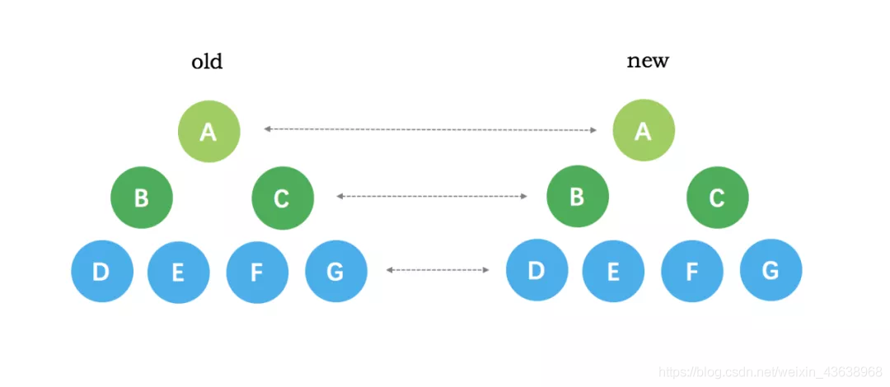
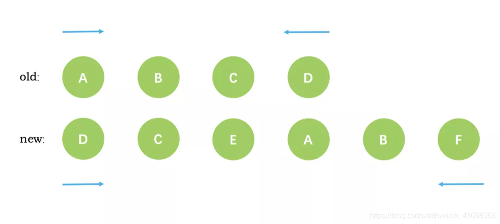

## 一、数据劫持

1. 初始化 data

   - `initData`方法中调用`observe`方法。`observe`方法中`new Observer`进行实例化`Observer`,并对`data`中定义数据通过`defineReactive`进行数据劫持。

   - `observe`方法回为每层对象添加`__ob__`属性

2. `$mount`时，调用`mountComponent`方法。`mountComponent`内，先定义`updateComponent`方法如下：

```js
updateComponent = () => {
  vm._update(vm._render(), hydrating);
};
```

之后将`updateComponent`作为`expOrFn`参数,实例化渲染 watcher。实例化中调用`get`方法

```js
// Class Watcher
 get() {
    pushTarget(this);
    let value;
    const vm = this.vm;
    try {
      value = this.getter.call(vm, vm); // 如果是computed 会再次读取其中的依赖 触发getter 此时Dep.target为computed Watcher
    } catch (e) {
      if (this.user) {
        handleError(e, vm, `getter for watcher "${this.expression}"`);
      } else {
        throw e;
      }
    } finally {
      // "touch" every property so they are all tracked as
      // dependencies for deep watching
      if (this.deep) {
        traverse(value);
      }
      popTarget();
      this.cleanupDeps();
    }
    return value;
    }
```

`this.getter`方法即`updateComponent`方法，在编译虚拟 Dom`vm._render()`过程中，读取`data`之中定义数据，触发`getter`。

```js
function defineReactive(
  obj: Object,
  key: string,
  val: any,
  customSetter?: ?Function,
  shallow?: boolean
) {
  const dep = new Dep();

  const property = Object.getOwnPropertyDescriptor(obj, key);
  if (property && property.configurable === false) {
    return;
  }

  // cater for pre-defined getter/setters
  const getter = property && property.get;
  const setter = property && property.set;
  if ((!getter || setter) && arguments.length === 2) {
    val = obj[key];
  }

  // 递归遍历对象
  let childOb = !shallow && observe(val);
  Object.defineProperty(obj, key, {
    enumerable: true,
    configurable: true,
    get: function reactiveGetter() {
      const value = getter ? getter.call(obj) : val;
      if (Dep.target) {
        dep.depend();
        if (childOb) {
          childOb.dep.depend();
          if (Array.isArray(value)) {
            dependArray(value);
          }
        }
      }
      return value;
    },
    set: function reactiveSetter(newVal) {
      const value = getter ? getter.call(obj) : val;
      /* eslint-disable no-self-compare */
      if (newVal === value || (newVal !== newVal && value !== value)) {
        return;
      }
      /* eslint-enable no-self-compare */
      if (process.env.NODE_ENV !== "production" && customSetter) {
        customSetter();
      }
      // #7981: for accessor properties without setter
      if (getter && !setter) return;
      if (setter) {
        setter.call(obj, newVal);
      } else {
        val = newVal;
      }
      childOb = !shallow && observe(newVal);
      dep.notify();
    },
  });
}
```

此时`Dep.target`即渲染`Watcher`。将此属性的`dep`与`渲染watcher`进行关联。

3. set
   - 更改属性时，触发属性的`set`方法。调用`dep.notify`方法

## 二、Dep 和 Watcher

1. Dep

```js
depend () {
    if (Dep.target) {
      Dep.target.addDep(this)
    }
  }

notify () {
    // stabilize the subscriber list first
    const subs = this.subs.slice()
    if (process.env.NODE_ENV !== 'production' && !config.async) {
        // subs aren't sorted in scheduler if not running async
        // we need to sort them now to make sure they fire in correct
        // order
        subs.sort((a, b) => a.id - b.id)
    }
    for (let i = 0, l = subs.length; i < l; i++) {
        subs[i].update()
    }
}
```

2. Watcher

```js
  addDep(dep: Dep) {
    const id = dep.id;
    if (!this.newDepIds.has(id)) {
      this.newDepIds.add(id);
      this.newDeps.push(dep);
      if (!this.depIds.has(id)) {
        dep.addSub(this);
      }
    }
  }
  update() {
    /* istanbul ignore else */
    if (this.lazy) {
      this.dirty = true;
    } else if (this.sync) {
      this.run();
    } else {
      // 添加异步队列
      queueWatcher(this);
    }
  }
  evaluate() {  // computed watcher 会调用
    this.value = this.get();
    this.dirty = false;
  }
  depend() {  // computed watcher 会调用
    let i = this.deps.length;
    while (i--) {
      this.deps[i].depend();
    }
  }
```

## 三、computed

1. 初始化`computed`

   - `computedWatcherOptions = { lazy: true }`
   - 调用`initComputed`，`initComputed`执行中，将`computed`中定义的方法作为`expOrFn`参数，`new Watcher`实例化`computed watcher`。实例化过程中调用`get`方法。若返回值为`data`中定义属性，则触发`getter`。将属性的`dep`与`computed watcher`进行关联。
     此时`Dep.target`为`computed watcher`。

   ```js
   function initComputed(vm: Component, computed: Object) {
     // $flow-disable-line
     const watchers = (vm._computedWatchers = Object.create(null));
     // computed properties are just getters during SSR
     const isSSR = isServerRendering();

     for (const key in computed) {
       const userDef = computed[key];
       const getter = typeof userDef === "function" ? userDef : userDef.get;
       if (process.env.NODE_ENV !== "production" && getter == null) {
         warn(`Getter is missing for computed property "${key}".`, vm);
       }

       if (!isSSR) {
         // create internal watcher for the computed property.
         watchers[key] = new Watcher(
           vm,
           getter || noop,
           noop,
           computedWatcherOptions
         );
       }

       // component-defined computed properties are already defined on the
       // component prototype. We only need to define computed properties defined
       // at instantiation here.
       if (!(key in vm)) {
         defineComputed(vm, key, userDef);
       } else if (process.env.NODE_ENV !== "production") {
         if (key in vm.$data) {
           warn(
             `The computed property "${key}" is already defined in data.`,
             vm
           );
         } else if (vm.$options.props && key in vm.$options.props) {
           warn(
             `The computed property "${key}" is already defined as a prop.`,
             vm
           );
         }
       }
     }
   }
   ```

   - 对`computed`中定义方法进行数据劫持，并定义其`get`方法如下：

   ```js
   function defineComputed(
     target: any,
     key: string,
     userDef: Object | Function
   ) {
     const shouldCache = !isServerRendering();
     if (typeof userDef === "function") {
       sharedPropertyDefinition.get = shouldCache
         ? createComputedGetter(key)
         : createGetterInvoker(userDef);
       sharedPropertyDefinition.set = noop;
     } else {
       sharedPropertyDefinition.get = userDef.get
         ? shouldCache && userDef.cache !== false
           ? createComputedGetter(key)
           : createGetterInvoker(userDef.get)
         : noop;
       sharedPropertyDefinition.set = userDef.set || noop;
     }
     if (
       process.env.NODE_ENV !== "production" &&
       sharedPropertyDefinition.set === noop
     ) {
       sharedPropertyDefinition.set = function () {
         warn(
           `Computed property "${key}" was assigned to but it has no setter.`,
           this
         );
       };
     }
     Object.defineProperty(target, key, sharedPropertyDefinition);
   }

   function createComputedGetter(key) {
     return function computedGetter() {
       const watcher = this._computedWatchers && this._computedWatchers[key];
       if (watcher) {
         if (watcher.dirty) {
           watcher.evaluate();
         }
         if (Dep.target) {
           watcher.depend();
         }
         return watcher.value;
       }
     };
   }
   ```

2. 渲染时读取 computed 中定义的属性时，触发该属性的`get`方法。在第一次调用`watcher.evaluate()`后，将`watcher.dirty`更改为`false`，之后便不会调用`watcher.get`方法。直接读取缓存。此时`Dep.target`为`computed watcher`。

## 四、watch

1. 初始化 watch
   - 调用`initWatch`方法，循环遍历`watch`中定义的属性 or 方法，并调用`createWatcher`方法，`createWatcher`最终调用`vm.$watch`方法
   ```js
   Vue.prototype.$watch = function (
     expOrFn: string | Function,
     cb: any,
     options?: Object
   ): Function {
     const vm: Component = this;
     if (isPlainObject(cb)) {
       return createWatcher(vm, expOrFn, cb, options);
     }
     options = options || {};
     options.user = true;
     const watcher = new Watcher(vm, expOrFn, cb, options);
     if (options.immediate) {
       try {
         cb.call(vm, watcher.value);
       } catch (error) {
         handleError(
           error,
           vm,
           `callback for immediate watcher "${watcher.expression}"`
         );
       }
     }
     return function unwatchFn() {
       watcher.teardown();
     };
   };
   ```
   将`watch`中定义属性的`key`作为`expOrFn`参数，`new Watcher`实例化`user watcher`。实例化过程中，调用`get`方法，读取`data`中定义的属性，触发`getter`,将此属性的`dep`与`user watcher`进行关联。

## 五、nextTick

1. queueWatcher

```js
// src\core\observer\scheduler.js
function flushSchedulerQueue() {
  currentFlushTimestamp = getNow();
  flushing = true;
  let watcher, id;

  // 刷新前对队列进行排序。
  // 这样可以确保：
  // 1。组件从父级更新到子级。（因为父母总是在子项之前创建）
  // 2。组件的用户观察程序在其渲染观察程序之前运行（因为用户观察程序是在渲染观察程序之前创建的）
  // 3。如果组件在父组件的观察程序运行期间被破坏，它的观察者可以被跳过。
  queue.sort((a, b) => a.id - b.id);

  // 不要缓存长度，因为可能会推送更多的观察者
  // 当我们运行现有的观察程序时
  for (index = 0; index < queue.length; index++) {
    watcher = queue[index];
    if (watcher.before) {
      watcher.before();
    }
    id = watcher.id;
    has[id] = null;
    watcher.run();
    // 在dev-build中，检查并停止循环更新。
    if (process.env.NODE_ENV !== "production" && has[id] != null) {
      circular[id] = (circular[id] || 0) + 1;
      if (circular[id] > MAX_UPDATE_COUNT) {
        warn(
          "You may have an infinite update loop " +
            (watcher.user
              ? `in watcher with expression "${watcher.expression}"`
              : `in a component render function.`),
          watcher.vm
        );
        break;
      }
    }
  }

  // 在重置状态之前保留投递队列的副本
  const activatedQueue = activatedChildren.slice();
  const updatedQueue = queue.slice();

  resetSchedulerState();

  // 调用组件更新并激活挂钩
  callActivatedHooks(activatedQueue);
  callUpdatedHooks(updatedQueue);

  // devtool hook
  /* istanbul ignore if */
  if (devtools && config.devtools) {
    devtools.emit("flush");
  }
}

function queueWatcher(watcher: Watcher) {
  // 过滤watcher
  const id = watcher.id;
  if (has[id] == null) {
    has[id] = true;
    if (!flushing) {
      queue.push(watcher);
    } else {
      // if already flushing, splice the watcher based on its id
      // if already past its id, it will be run next immediately.
      let i = queue.length - 1;
      while (i > index && queue[i].id > watcher.id) {
        i--;
      }
      queue.splice(i + 1, 0, watcher);
    }
    // queue the flush
    if (!waiting) {
      waiting = true;

      if (process.env.NODE_ENV !== "production" && !config.async) {
        flushSchedulerQueue();
        return;
      }
      nextTick(flushSchedulerQueue);
    }
  }
}
```

## 六、vuex

- state、getters
- action
- mutation
- modoules

## 七、vue-router

1. 初始化

- 执行 `Vue.use(VueRouter)` 的时候，实际上就是在执行 `install` 函数，为了确保 `install` 逻辑只执行一次，用了 `install.installed` 变量做已安装的标志位。
- 混入`beforeCreate`生命周期，`this._router.init(this)`初始化 `vueRouter`
- 注册全局属性`$router、$route`
- 注册全局组件`router-link、router-view`

```js
install (Vue) {
  if (install.installed && _Vue === Vue) return
  install.installed = true

  _Vue = Vue

  const isDef = v => v !== undefined

  const registerInstance = (vm, callVal) => {
    let i = vm.$options._parentVnode
    if (isDef(i) && isDef(i = i.data) && isDef(i = i.registerRouteInstance)) {
      i(vm, callVal)
    }
  }

  Vue.mixin({
    beforeCreate () {
      if (isDef(this.$options.router)) {
        this._routerRoot = this
        this._router = this.$options.router
        this._router.init(this)
        Vue.util.defineReactive(this, '_route', this._router.history.current)
      } else {
        this._routerRoot = (this.$parent && this.$parent._routerRoot) || this
      }
      registerInstance(this, this)
    },
    destroyed () {
      registerInstance(this)
    }
  })

  Object.defineProperty(Vue.prototype, '$router', {
    get () { return this._routerRoot._router }
  })

  Object.defineProperty(Vue.prototype, '$route', {
    get () { return this._routerRoot._route }
  })

  Vue.component('RouterView', View)
  Vue.component('RouterLink', Link)

  const strats = Vue.config.optionMergeStrategies
  strats.beforeRouteEnter = strats.beforeRouteLeave = strats.beforeRouteUpdate = strats.created
}
```

2. 路由状态存储

3. hash、history 两种模式比较

- 页面更新流程

```js
this.$router.push(path)
 -->
HashHistory.push()
-->
History.transitionTo()
-->
const  route = this.router.match(location, this.current)会进行地址匹配，得到一个对应当前地址的route(路由信息对象)
-->
History.updateRoute(route)
 -->
 app._route=route (Vue实例的_route改变)   由于_route属性是采用vue的数据劫持，当_route的值改变时，会执行响应的render( )
-- >
vm.render()   具体是在<router-view></router-view> 中render
 -->
window.location.hash = route.fullpath (浏览器地址栏显示新的路由的path)
```

HTML5History 模式的 vue-router 代码结构以及更新视图的逻辑与 hash 模式基本类似，和 HashHistory 的步骤基本一致，只是 HashHistory 的 push() 和 replace()变成了 HTML5History.pushState()和 HTML5History.replaceState(),浏览器地址栏 URL 的监听事件由 `window.hashchange` 改为 `window.popstate`

hash 模式 会在浏览器的 URL 中加入'#'，而 HTM5History 就没有'#'号，URL 和正常的 URL 一样。 另外： history.pushState()相比于直接修改 hash 主要有以下优势：

- pushState 设置的新 URL 可以是与当前 URL 同源的任意 URL；而 hash 只可修改#后面的部分，故只可设置与当前同文档的 URL

- pushState 设置的新 URL 可以与当前 URL 一模一样，这样也会把记录添加到栈中；而 hash 设置的新值必须与原来不一样才会触发记录添加到栈中

- pushState 通过 stateObject 可以添加任意类型的数据到记录中；而 hash 只可添加短字符串

- pushState 可额外设置 title 属性供后续使用

## vue-diff

1. 比较只会在同层级进行，不会跨层级比较

- oldvnode 和 newvnode 都有文本节点---执行--->用新的文本节点替换旧文本节点
- oldvnode 没有子节点，newvnode 有子节点---执行--->添加新的子节点
- oldvnode 有子节点，newvnode 没有子节点---执行--->删除旧的子节点
- oldvnode 和 newvnode 都有子节点---执行--->updateChildren()方法



2.  比较的过程中，循环从两边向中间收拢

    - 首尾指针法

      ① 依次比对，当比较成功后退出当前比较

      ② 渲染结构以 newVnode 为准

      ③ 每次比较成功之后 start 点和 end 点向中间靠拢

      ④ 当新旧节点中有一个 start 点跑到 end 点右侧时终止比较

      ⑤ 如果都匹配不到，则旧虚拟 DOM 的 key 值 只去比对新虚拟 DOM 的 key 值，如果 key 相同则复用，并移动到新虚拟 DOM 的位置



````js
function updateChildren (parentElm, oldCh, newCh, insertedVnodeQueue, removeOnly) {
    let oldStartIdx = 0 // 旧头索引
    let newStartIdx = 0 // 新头索引
    let oldEndIdx = oldCh.length - 1 // 旧尾索引
    let newEndIdx = newCh.length - 1 // 新尾索引
    let oldStartVnode = oldCh[0] // oldVnode的第一个child
    let oldEndVnode = oldCh[oldEndIdx] // oldVnode的最后一个child
    let newStartVnode = newCh[0] // newVnode的第一个child
    let newEndVnode = newCh[newEndIdx] // newVnode的最后一个child
    let oldKeyToIdx, idxInOld, vnodeToMove, refElm

    // removeOnly is a special flag used only by <transition-group>
    // to ensure removed elements stay in correct relative positions
    // during leaving transitions
    const canMove = !removeOnly

    // 如果oldStartVnode和oldEndVnode重合，并且新的也都重合了，证明diff完了，循环结束
    while (oldStartIdx <= oldEndIdx && newStartIdx <= newEndIdx) {
      // 如果oldVnode的第一个child不存在
      if (isUndef(oldStartVnode)) {
        // oldStart索引右移
        oldStartVnode = oldCh[++oldStartIdx] // Vnode has been moved left

      // 如果oldVnode的最后一个child不存在
      } else if (isUndef(oldEndVnode)) {
        // oldEnd索引左移
        oldEndVnode = oldCh[--oldEndIdx]

      // oldStartVnode和newStartVnode是同一个节点
      } else if (sameVnode(oldStartVnode, newStartVnode)) {
        // patch oldStartVnode和newStartVnode， 索引左移，继续循环
        patchVnode(oldStartVnode, newStartVnode, insertedVnodeQueue)
        oldStartVnode = oldCh[++oldStartIdx]
        newStartVnode = newCh[++newStartIdx]

      // oldEndVnode和newEndVnode是同一个节点
      } else if (sameVnode(oldEndVnode, newEndVnode)) {
        // patch oldEndVnode和newEndVnode，索引右移，继续循环
        patchVnode(oldEndVnode, newEndVnode, insertedVnodeQueue)
        oldEndVnode = oldCh[--oldEndIdx]
        newEndVnode = newCh[--newEndIdx]

      // oldStartVnode和newEndVnode是同一个节点
      } else if (sameVnode(oldStartVnode, newEndVnode)) { // Vnode moved right
        // patch oldStartVnode和newEndVnode
        patchVnode(oldStartVnode, newEndVnode, insertedVnodeQueue)
        // 如果removeOnly是false，则将oldStartVnode.eml移动到oldEndVnode.elm之后
        canMove && nodeOps.insertBefore(parentElm, oldStartVnode.elm, nodeOps.nextSibling(oldEndVnode.elm))
        // oldStart索引右移，newEnd索引左移
        oldStartVnode = oldCh[++oldStartIdx]
        newEndVnode = newCh[--newEndIdx]

      // 如果oldEndVnode和newStartVnode是同一个节点
      } else if (sameVnode(oldEndVnode, newStartVnode)) { // Vnode moved left
        // patch oldEndVnode和newStartVnode
        patchVnode(oldEndVnode, newStartVnode, insertedVnodeQueue)
        // 如果removeOnly是false，则将oldEndVnode.elm移动到oldStartVnode.elm之前
        canMove && nodeOps.insertBefore(parentElm, oldEndVnode.elm, oldStartVnode.elm)
        // oldEnd索引左移，newStart索引右移
        oldEndVnode = oldCh[--oldEndIdx]
        newStartVnode = newCh[++newStartIdx]

      // 如果都不匹配
      } else {
        if (isUndef(oldKeyToIdx)) oldKeyToIdx = createKeyToOldIdx(oldCh, oldStartIdx, oldEndIdx)

        // 尝试在oldChildren中寻找和newStartVnode的具有相同的key的Vnode
        idxInOld = isDef(newStartVnode.key)
          ? oldKeyToIdx[newStartVnode.key]
          : findIdxInOld(newStartVnode, oldCh, oldStartIdx, oldEndIdx)

        // 如果未找到，说明newStartVnode是一个新的节点
        if (isUndef(idxInOld)) { // New element
          // 创建一个新Vnode
          createElm(newStartVnode, insertedVnodeQueue, parentElm, oldStartVnode.elm)

        // 如果找到了和newStartVnodej具有相同的key的Vnode，叫vnodeToMove
        } else {
          vnodeToMove = oldCh[idxInOld]
          /* istanbul ignore if */
          if (process.env.NODE_ENV !== 'production' && !vnodeToMove) {
            warn(
              'It seems there are duplicate keys that is causing an update error. ' +
              'Make sure each v-for item has a unique key.'
            )
          }

          // 比较两个具有相同的key的新节点是否是同一个节点
          //不设key，newCh和oldCh只会进行头尾两端的相互比较，设key后，除了头尾两端的比较外，还会从用key生成的对象oldKeyToIdx中查找匹配的节点，所以为节点设置key可以更高效的利用dom。
          if (sameVnode(vnodeToMove, newStartVnode)) {
            // patch vnodeToMove和newStartVnode
            patchVnode(vnodeToMove, newStartVnode, insertedVnodeQueue)
            // 清除
            oldCh[idxInOld] = undefined
            // 如果removeOnly是false，则将找到的和newStartVnodej具有相同的key的Vnode，叫vnodeToMove.elm
            // 移动到oldStartVnode.elm之前
            canMove && nodeOps.insertBefore(parentElm, vnodeToMove.elm, oldStartVnode.elm)

          // 如果key相同，但是节点不相同，则创建一个新的节点
          } else {
            // same key but different element. treat as new element
            createElm(newStartVnode, insertedVnodeQueue, parentElm, oldStartVnode.elm)
          }
        }

        // 右移
        newStartVnode = newCh[++newStartIdx]
      }
    }```
````

## vue-组件化

```js
Vue.prototype.extends = function () {};
Cort.extends();
this.init();
mergeOption();
```
